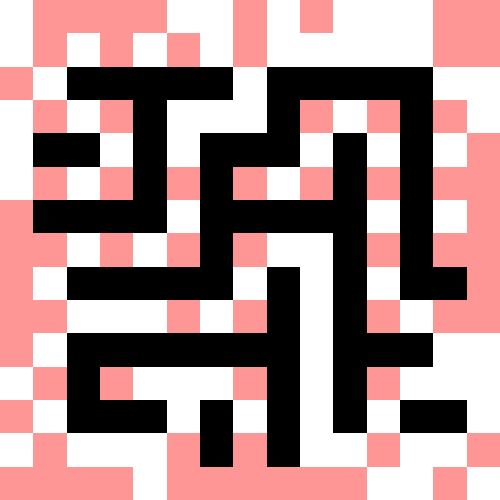

# Vacuum World Simulation

This Python project simulates a vacuum cleaning robot using the and-or search algorithm for autonomous robot pathfinding and area coverage. It loads a grid representation of a room from a PNG image and allows users to specify robot missions (starting positions, input methods). The robots navigate the vacuum world to complete their missions efficiently.

## Description

Pathfinding using AO* Algorithm: `f(n) = g(n) + h(n)`

### Simulation

- g(n) represents the number of steps taken to reach the current position (node) from the start position (node)
- h(n) represents the Manhattan distance from the current position (node) to the goal
- f(n) represents the total cost of the path
- Diagonal movement is NOT ALLOWED therefore the heuristic is Manhattan distance not the Euclidean distance
- Robot is NOT considered an Obstacle (so that other robots can cross their paths), and can move and interact with items well

### Colors

- Black pixels are obstacles
- White pixels are empty/clean spaces (can be traversed)
- Red (light red) pixels are dirty spaces (can be traversed over to clean)
- Cyan pixels are robots
- Yellow pixels are robots paths (these change every time a robot calculates its path)

### Pathfinding

- Path finding happens one step at a time, once a path is found, robot moves one step of the path at every time step. Then the next robot calculates its path and so on. Robots are allowed to cross paths for simplicity and double the cleaning!
- The and-or search algorithm is used to find multiple plans of approaching a goal position and then select the best one.
- Movements and interactions with the robots for each time step are printed to the console.
- If there are any pathfinding errors, the simulation will throw an exception or time out after pre-set timesteps.

### Vacuum World

- The simulation is limited to a single grid loaded from a PNG image `vacuum_world.png`.
- This can be randomly auto generated using `create_vacuum_world.py`. There are inbuilt parameters for the grid size and % of dirty cells
- Vacuum world layout and dirty cells can be changed by modifying the `vacuum_world.png` file. An easy way to edit images is via VS Code Extension [Luna Paint](https://marketplace.visualstudio.com/items?itemName=Tyriar.luna-paint)
- Example image:
- <!-- markdownlint-disable MD033 -->
  
  <!-- markdownlint-disable MD033 -->

> Note: The vacuum world image should be a PNG file with each pixel representing a grid space in the vacuum world.
> Other vacuum cleaner like features can be added in the future but not implemented due to scope of project.

## Dependencies

- Python >= 3.10
- numpy
- opencv-python
- Pillow

## Usage

1. Install the required dependencies using pip:

   ```bash
   pip install -r requirements.txt
   ```

2. Run the simulation script:

   ```bash
   python clean.py
   ```

> Make sure correct python environment is sourced. Tested with Python > 3.10. Even though not tested with older versions, it will likely work above 3.8 with the required libraries installed.

### Adding New Simulation Jobs

To add new simulation jobs, you can create instances of the `Job` class and configure them with the desired robot positions and manual control method. Simply create a new `Job` instance and use the `add_robot` method to add robots to the simulation. Then, call the `simulate_vacuum_world` method to run the simulation.

Example:

```python
# Create a new simulation job
new_job = Job()

# Add robots to the simulation
new_job.add_robot((0, 0))
new_job.add_robot((grid.width - 1, grid.height - 1))

# Run the simulation
new_job.simulate_vacuum_world()
```

### Slow Down Simulation or Change Image Scale

In `clean.py`, you can change `image_scale_factor` variable to change the size of the displayed image related to the grid size.

```python
# Parameters for visualization:
image_scale_factor = 50  # Scale factor for image display
# NOTE: (grid size * image_scale_factor = display image size)
sim_time_step = 0.01  # seconds between each iteration of the simulation
```

To slow down the simulation, you can set the `sim_time_step` variable to a higher value. The default value is 0.01 seconds.
> Logs for each time step can be seen in the console.

### Creating New Worlds

To create a new vacuum world, you can run the `create_vacuum_world.py` script.

```bash
python create_vacuum_world.py
```

If needed, some parameters can be changed in the script. Keep in mind, even though bigger grids work, it will take much longer to run to find the optimal path each time step.

```python
dirt_probability = 0.7
default_height = 15
default_width = 15
```

### Manual Control

To enable manual control, set `manual_control = True` as an argument to the `Job` instance creation in `clean.py`. You will be prompted to enter the robot's position and desired direction in the console. Working example is already in the script.

```python
test_3 = Job(image_scale_factor, sim_time_step, max_steps=10 * grid.size, manual_control=True)
```

> Note: You will need to manually type the desired direction in the console and then press Enter. Basic Python input() method.

## License

This project is licensed under the [MIT license](LICENSE)
